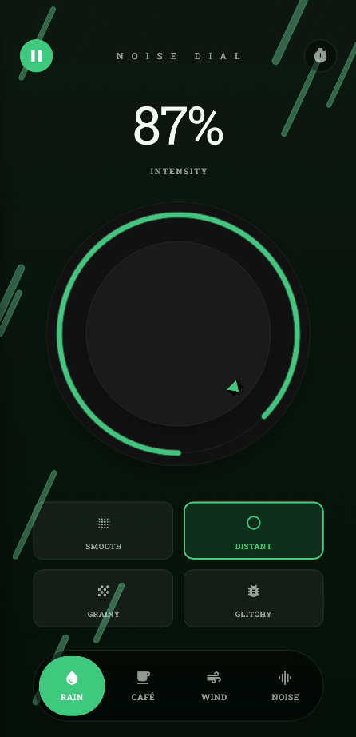

# Noise Dial - Ambient Sound Generator

A beautiful, minimalist ambient sound generator app built with Expo and React Native. Control intensity, texture, and sound type with an intuitive circular dial interface.



## Features

- 🎛️ **Interactive Dial Control**: 
  - Precision 360-degree rotation control
  - Gesture-based interaction using `react-native-gesture-handler`
  - Real-time visual feedback with animated SVG progress rings
  - Smooth inertia and dampening for a realistic knob feel

- 🎨 **Texture Selection**: 
  - **SMOOTH**: Clean, filtered sound with gentle characteristics
  - **DISTANT**: Low-pass filtered, muted tones for a faraway effect
  - **GRAINY**: Added texture and mid-range emphasis
  - **GLITCHY**: Experimental modulation and random variations

- 🎵 **Sound Types & Themes**: 
  - **RAIN**: Green-themed, generated from pink noise with randomized drop synthesis
  - **CAFÉ**: Warm brown-themed, simulating ambient chatter and clatter
  - **WIND**: Teal-themed, using band-passed noise with gust modulation
  - **NOISE**: Purple-themed, pure procedural noise generation (White/Pink/Brown)
  - *Each mode features dynamic, theme-aware colors for a cohesive emotional design.*

- 🌟 **Emotional Design & Feedback**:
  - **Dynamic Backgrounds**: `react-native-reanimated` particle systems that react to sound type and intensity (e.g., rain drops, wind wisps, rising steam).
  - **Haptic Feedback**: Subtle, tactile `expo-haptics` responses for dial rotation, button presses, and limit reaching.
  - **Interactive Audio Feedback**: Custom-generated, low-latency UI sounds for every interaction (clicks, chimes, thuds) via `FeedbackService`.
  - **Smooth Animations**: All transitions and state changes are animated for a fluid experience.

- 🔊 **Advanced Audio Processing**: 
  - **Hybrid Engine**: Combines high-quality samples with procedural generation.
  - **Real-time Synthesis**: Uses Web Audio API (on Web) and `expo-audio` (on Native) for dynamic filtering, volume, and modulation.
  - **Seamless Looping**: Smart buffering and cross-fading for uninterrupted playback.
  - **Background Playback**: Continues playing audio when the app is backgrounded or screen is off.

- ⏱️ **Sleep Timer**: 
  - Set a timer (5m to 4h) to automatically fade out and stop playback.
  - Visual countdown within the dial interface.

## Project Structure

```
noise_dial/
├── app/                    # Expo Router app directory
│   ├── _layout.tsx         # Root layout with gesture handler & status bar
│   └── index.tsx           # Main entry point
├── components/             # Reusable UI components
│   ├── app-header.tsx      # Header with play/pause and timer controls
│   ├── noise-dial.tsx      # Core circular dial with gesture logic & SVG animations
│   ├── sound-selector.tsx  # Sound type selection pill
│   ├── texture-selector.tsx # Texture grid selector
│   └── SoundBackground.tsx # Reanimated particle background system
├── screens/                # Screen components
│   └── noise-dial-screen.tsx # Main screen orchestrating state & UI
├── services/               # Business logic & Singletons
│   ├── audio-service.ts    # Core audio engine (Web Audio API + Expo Audio)
│   └── feedback-service.ts # UI sound generation & haptic feedback controller
├── constants/              # App constants
│   └── themes.ts           # Dynamic theme definitions (Light/Dark + Sound variants)
└── assets/                 # Static assets (images, sounds)
```

## Getting Started

### Prerequisites

- Node.js 18+ installed
- npm, yarn, pnpm, or bun
- Expo CLI (optional)
- iOS Simulator or Android Emulator

### Installation

1. **Clone the repository** (or navigate to the project directory)

2. **Install dependencies**:
   ```bash
   npm install
   ```

3. **Start the development server**:
   ```bash
   npm start
   ```

4. **Run on your preferred platform**:
   - Press `i` for iOS Simulator
   - Press `a` for Android Emulator
   - Press `w` for Web browser

## How It Works

### Audio Engine (`AudioService`)

The app employs a sophisticated audio engine that adapts to the platform:

1. **Web (Web Audio API)**:
   - Uses `AudioContext` for a full node graph.
   - **Procedural Generation**: Creates Noise (White/Pink/Brown) and oscillators in real-time.
   - **Filters**: Biquad filters (LowPass, HighPass, BandPass) shape the tone based on "Texture".
   - **Modulation**: LFOs (Low Frequency Oscillators) modulate gain and frequency to create movement (e.g., wind gusts, glitch effects).

2. **Native (Expo Audio)**:
   - Uses `expo-audio` for high-performance playback.
   - **Sample Management**: Loads optimized, texture-specific audio samples.
   - **Procedural Fallback**: Generates WAV data on-the-fly for pure noise modes.
   - **Background Audio**: Configured with `UIBackgroundModes` (iOS) and Foreground Services (Android) to keep the engine running.

### Emotional Design Implementation

- **Visuals**: The `NoiseDial` component isn't just a slider; it's a physical metaphor. The resistance, the inertia, and the visual "fill" of the ring mimic a physical volume knob.
- **Atmosphere**: The `SoundBackground` component uses `SharedValues` and `Reanimated` to drive particle systems that visually represent the sound (e.g., faster rain at higher intensity), creating a multi-sensory connection.
- **Touch & Feel**: `FeedbackService` generates short, zero-latency WAV byte strings for UI sounds, ensuring that every tap and turn feels responsive and grounded.

## Technical Details

### Dependencies

- **expo-audio**: Modern, robust audio playback.
- **react-native-gesture-handler**: Complex pan and touch handling.
- **react-native-reanimated**: High-performance, declarative animations (running on UI thread).
- **react-native-svg**: Vector graphics for the dial and background elements.
- **expo-haptics**: Physical feedback.
- **expo-linear-gradient**: Mood-setting backgrounds.

### Platform Support

- ✅ **Web**: Full procedural generation via Web Audio API.
- ✅ **iOS**: Background audio support, optimized sample playback.
- ✅ **Android**: Foreground service integration for persistent playback.

## Development Standards

This project adheres to strict code quality standards:
- **TypeScript**: Full type safety.
- **Functional Components**: React Hooks (`useSharedValue`, `useAnimatedStyle`, `useCallback`).
- **File Structure**: Feature-based organization within `components` and `services`.

## License

This project is private and proprietary.

## Credits

- Built with [Expo](https://expo.dev)
- Audio engine concepts based on Web Audio API synthesis techniques.
